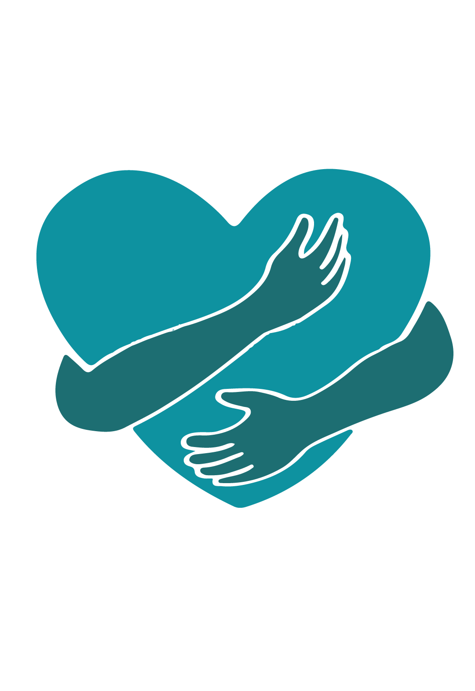

# Chat with Strangers Application



Welcome to **Chat with Strangers**! This is a real-time chat application where two random strangers can chat with each other anonymously. The application uses **Socket.IO** for real-time communication and **Next.js** for both the frontend and backend. The code is mostly written in **TypeScript**, but the backend is written in **JavaScript** to resolve certain issues with Next.js.

## Live Demo

You can try out the live version of the application here:  
🌐 [ravish.fun](https://ravish.fun)

## Features

- **Real-time Chat**: Users can chat instantly with random strangers using Socket.IO.
- **Anonymous Chat**: No login required, just enter and start chatting.
- **Responsive Design**: Fully responsive interface for both desktop and mobile users.
- **Socket.IO Integration**: Seamless communication using WebSockets for real-time data transfer.

## Technologies Used

- **Next.js** (Frontend & Backend)
- **Socket.IO** (Real-time communication)
- **TypeScript** (For most of the code)
- **JavaScript** (For the backend to resolve Next.js-specific issues)
- **Tailwind CSS** (For styling)
- **Node.js** (For backend)

## Installation

To run this project locally, follow these steps:

### 1. Clone the repository

```bash
git clone https://github.com/cykoravish/chat-with-stranger-next.git

cd chat-with-stranger-next

npm install

create .env and add
PORT=
NODE_ENV=
HOST_NAME=

npm run dev

Go to http://localhost:PORT to view the application.
```
## Contributing

  We welcome contributions to this project! If you'd like to contribute, feel free to open a Pull Request (PR) with your changes. Here are some ways you can help:

   - Fix Bugs: Identify and resolve bugs.
   - Add Features: Propose new features or improve existing ones.
   - Improve Code: Help clean up and refactor the codebase.
   - Improve UI/UX: Suggest or implement changes to improve the user interface or experience.

## How to Contribute

   - Fork the repository.
   - Create a new branch for your changes.
   - Make your changes and commit them.
   - Push your changes to your forked repository.
   - Open a pull request to the main repository.

## Issues

- If you encounter any bugs or have any feature requests, please open an issue on the repository’s Issues page.

## License

- This project is licensed under the MIT License.
